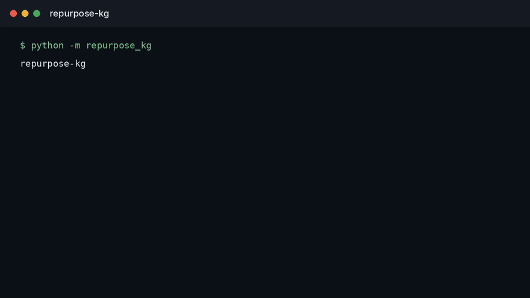

<div align="center">

# repurpose-kg

**Drug-repurposing candidates from a biomedical graph, scored only on links that did not exist yet.**

[](LICENSE)

**Status:** runnable on designed examples. Not a clinical system, a LIMS, or a trained model.

</div>

---

## Watch

<p align="center">
  
</p>

The clip is `python -m repurpose_kg`, the program in this repository. [Full video](docs/demo.mp4).

## The problem

A knowledge graph of drugs, genes, and diseases will happily predict a link the graph already used to train itself. Random edge splits leak the future into the past: a 2024 indication helps "predict" a 2019 one, and the leaderboard looks solved.

Repurposing is a claim about time. The only honest test is a cut date. Train on the graph as it stood, then score edges that appeared later. Anything else is a reconstruction of the literature, not a candidate list.

## The measurement I would trust

| Rule | Why |
| --- | --- |
| Time split | Training edges are strictly older than test edges |
| No node feature from the future | A disease embedding fit on the full graph is leakage |
| Rank, plus a baseline | A simple co-occurrence baseline sits next to the model |
| Abstention on weak support | A novel-looking pair with one paper does not get a sharp probability |

Hits without the cut date are not results. A demo that highlights a famous repurposing story already in the training era is not a result.

## What this repository is

`repurpose-kg` scores future indications from gene links dated before the cut, and prints the leaky score beside it. It does not ship a trained link predictor. Phenotype ranking is a different question, in [phenorank](https://github.com/TechieGoku2623/phenorank).

## Run

```bash
python3 -m venv .venv
source .venv/bin/activate
pip install -e .
python -m repurpose_kg
python -m unittest discover -s tests -v
```

## Author

**Choppa Devasai Pranatheswar** · [LinkedIn](https://www.linkedin.com/in/devasai-pranatheswar)
